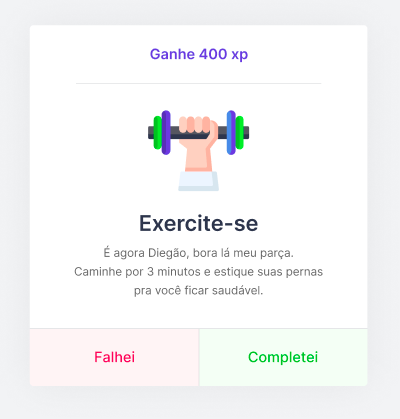

<h1 align="center">
  
  <br/>
  
</h1>

<br />

## 💻 Projeto


Project developed during the <strong>Next Level Week</strong> that aims to help programmers do exercises for help your health
<strong>Move.It</strong> is a app to help programmers to do exercises sometimes in the day, by the way the programmer get some experience when complete the challenge that way motivate the programmer.

<br />

## 🧑‍🦱 Profile Page

<h1 align="center">
  
</h1>

##  ⚡ Challenge

<h1 align="center">
    
</h1>

## 🏆 Reward

<h1 align="center">
    
</h1>

<br />

## 🚀 Techs

This project was developed with the following technologies:

- [Node.js](https://nodejs.org/en/)
- [React](https://reactjs.org)
- [Next](https://nextjs.org/)

<br />

## 🔥 Install

```bash
# Clone this rep
$ git clone https://github.com/samueljrz/NLW-IV-MoveIt

# After, enter the web folder and execute the comands:
$ npm
$ npm start
```